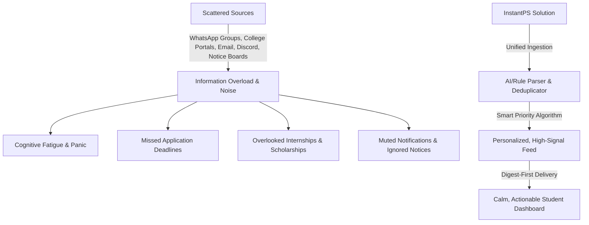
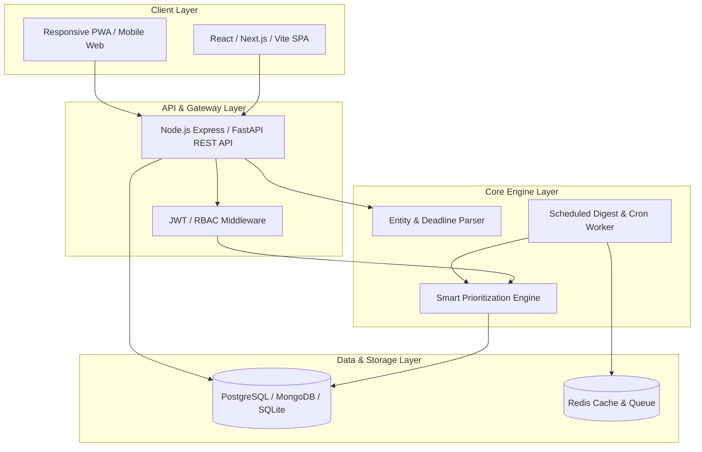
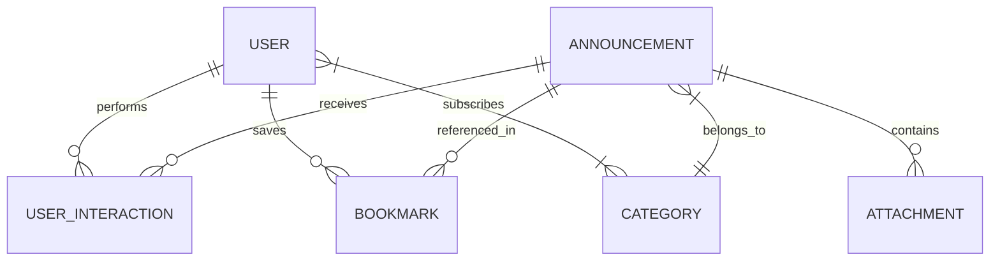

# InstantPS: Smart Student Information Hub

> **A personalized, high-signal information prioritization and deadline alert platform designed to eliminate student information overload.**

---

## 1. Executive Summary & Problem Analysis

### 1.1 The Problem Statement (from `spec.md`)
> **Problem Statement:** Students often miss important opportunities, deadlines, events, internships, competitions, and academic information because updates are scattered across multiple platforms and communication channels.
> 
> **Goal:** Design and prototype a solution that helps students access relevant and important information at the right time without creating additional information overload.

### 1.2 Root Cause Breakdown


### 1.3 Key Value Proposition: "Better Prioritization, Not More Information"
- **Unified Aggregation**: Consolidate disparate channels (official notices, placement cell, clubs, academic circulars).
- **Time-to-Deadline Ranking**: Dynamically boost urgent, high-stakes deadlines (e.g., closing in <24h).
- **Hyper-Relevance**: Filter by year, branch, degree, and opt-in interest tags (e.g., AI/ML, Hackathons, Cultural).
- **Digest-First Notification Strategy**: Zero spam. Single daily morning/evening digest with emergency-only push notifications.
- **Source Trust Tiering**: Immediate visual badges verifying official college notices vs. student club announcements vs. community posts.

---

## 2. Primary Users & Persona Mapping

| User Persona | Key Pain Points | Primary Needs | Success Metric |
| :--- | :--- | :--- | :--- |
| **First/Second Year Student** (Exploration Phase) | Overwhelmed by dozens of campus club WhatsApp groups; misses workshop registrations. | Clear category tags (Clubs, Academics), event calendar, peer recommendations. | 80%+ event participation awareness without group clutter. |
| **Pre-Final / Final Year Student** (Placement & Career) | Misses short-window internship and job applications; crucial placement emails get buried. | Urgent deadline countdowns, eligibility filtering (Branch/GPA), resume submission alerts. | Zero missed placement/internship deadlines. |
| **Faculty & Department Admins** | Low circular open rates; students claim they "never received the notice". | Targeted broadcasts (by branch/year), receipt analytics, urgent push overrides. | >90% notice acknowledgment within 24 hours. |
| **Placement Cell & Club Leads** | Spamming WhatsApp groups leads to students muting chats. | High engagement rate, direct RSVP links, authenticated announcement badges. | Increased RSVP-to-attendance conversion. |

---

## 3. Comprehensive Requirements

### 3.1 Functional Requirements (FR)

#### FR-1: Multi-Channel Content Ingestion & Publishing
- **Admin & Faculty Direct Portal**: Web form for posting notices with metadata (Department, Year, Category, Urgency, Deadline, Attachments).
- **Email/Webhook Forwarder**: Ingest circulars sent via college broadcast lists.
- **Deduplication Engine**: Hash and text similarity checks to prevent duplicate posts across channels.

#### FR-2: Smart Categorization & Entity Extraction
- Categorize into 5 primary pillars:
  1. `ACADEMIC` (Exam schedules, syllabus changes, timetable notices, fee dues)
  2. `CAREER_INTERNSHIP` (Placement drives, off-campus hiring, internships, resume calls)
  3. `COMPETITION_HACKATHON` (Hackathons, research paper calls, case competitions)
  4. `CAMPUS_EVENT` (Club orientations, fests, workshops, sports)
  5. `ADMIN_ALERT` (Holidays, emergency closures, hostel notices)
- Automatically parse dates, times, eligibility criteria, and submission links.

#### FR-3: Dynamic Priority Scoring Engine
- Computes a dynamic `PriorityScore` (0 to 100) for every student-post pair:
$$\text{PriorityScore} = (W_{\text{urgency}} \times S_{\text{urgency}}) + (W_{\text{relevance}} \times S_{\text{relevance}}) + (W_{\text{source}} \times S_{\text{source}}) - S_{\text{decay}}$$
  - **Urgency ($S_{\text{urgency}}$)**: Based on hours remaining until deadline.
  - **Relevance ($S_{\text{relevance}}$)**: Match between post tags and student's profile (Branch, Year, Opt-in interests).
  - **Source Trust ($S_{\text{source}}$)**: Official Administration (1.0), Placement Cell (0.9), Verified Clubs (0.7), Unverified (0.4).
  - **Decay ($S_{\text{decay}}$)**: Gradually drops score for non-deadline expired posts.

#### FR-4: Student Dashboard & UX
- **Action Strip ("Today's Focus")**: Top 3 urgent deadlines due within 48 hours.
- **Smart Unified Feed**: Ranked posts with filter tabs (`All`, `Urgent`, `Academic`, `Career`, `Events`).
- **Interactive Deadline Calendar**: Visual month/week timeline of all due dates with 1-click sync to Google Calendar / iCal.
- **Save & Dismiss Actions**: Bookmark important items; dismiss or mute low-relevance topics.

#### FR-5: Non-Intrusive Digest & Notification System
- **Daily Smart Digest**: Configurable morning briefing (e.g., 08:00 AM) summarizing today's key notices and deadlines.
- **Emergency Bypass**: Only critical `ADMIN_ALERT` or `< 12h` deadline items trigger push notifications.
- **Quiet Hours**: Respect student-defined quiet windows (e.g., 10:00 PM – 07:00 AM).

---

### 3.2 Non-Functional Requirements (NFR)

- **Performance**: Feed loading latency $< 300\text{ms}$ with indexed database queries and caching.
- **Usability & Aesthetics**: Clean, calm modern interface (Tailwind CSS, Inter font, low cognitive friction dark/light themes, zero flashing banners).
- **Scalability**: Capable of handling $10,000+$ active students and concurrent digest delivery jobs via background workers (BullMQ / Redis).
- **Security & Privacy**: Role-Based Access Control (`STUDENT`, `CLUB_LEAD`, `FACULTY`, `SUPER_ADMIN`), JWT authentication, encrypted student profile preferences.

---

## 4. System Architecture & Tech Stack

### 4.1 Architecture Diagram


### 4.2 Recommended Technology Stack

| Layer | Recommended Choice | Lightweight MVP Alternative |
| :--- | :--- | :--- |
| **Frontend** | React 18 + Vite + Tailwind CSS + Lucide Icons | HTML5 + Modern CSS (Variables/Glassmorphism) + Vanilla JS |
| **Backend API** | Node.js (Express / Fastify) with TypeScript | Python (FastAPI / Flask) |
| **Database** | PostgreSQL with Prisma ORM / MongoDB | SQLite (local zero-setup) |
| **Task Queue** | BullMQ + Redis / Celery | `node-cron` / Python `schedule` |
| **Notifications** | Web Push API / Nodemailer (Email Digest) | In-app notification center |

---

## 5. Database Schema & Data Models

### 5.1 Entity Relationship Overview


### 5.2 Core Data Schemas (TypeScript Interfaces)

```typescript
// User Profile & Preferences
interface User {
  id: string;
  name: string;
  email: string;
  role: 'STUDENT' | 'FACULTY' | 'ADMIN' | 'CLUB_LEAD';
  department: string;       // e.g., "Computer Science"
  yearOfStudy: number;      // 1, 2, 3, 4
  interests: string[];      // ['hackathons', 'internships', 'ai-ml', 'robotics']
  digestPreference: {
    enabled: boolean;
    time: string;           // "08:30"
    channel: 'IN_APP' | 'EMAIL' | 'BOTH';
    quietHoursStart: string;// "22:00"
    quietHoursEnd: string;  // "07:00"
  };
  createdAt: Date;
}

// Announcement / Opportunity Entity
interface Announcement {
  id: string;
  title: string;
  content: string;
  summary: string;          // Auto-generated 2-line quick summary
  category: 'ACADEMIC' | 'CAREER_INTERNSHIP' | 'COMPETITION_HACKATHON' | 'CAMPUS_EVENT' | 'ADMIN_ALERT';
  tags: string[];           // ['placement', 'google', 'cse', 'final-year']
  targetDepartments: string[]; // ['ALL'] or ['Computer Science', 'IT']
  targetYears: number[];    // [3, 4]
  source: {
    authorId: string;
    authorName: string;
    organization: string;   // "Training & Placement Cell"
    trustTier: 'OFFICIAL' | 'VERIFIED_CLUB' | 'COMMUNITY';
  };
  deadlineDate?: Date;      // Optional application/event deadline
  eventDate?: Date;         // Optional event scheduled time
  actionUrl?: string;       // Link to register or submit application
  isUrgentOverride: boolean;// Admin-flagged urgent broadcast
  createdAt: Date;
}

// Student Interaction Record (for tracking & smart ranking feedback)
interface UserInteraction {
  userId: string;
  announcementId: string;
  status: 'UNREAD' | 'READ' | 'SAVED' | 'DISMISSED';
  actionClicked: boolean;
  interactedAt: Date;
}
```

---

## 6. REST API Specification

| Method | Endpoint | Description | Auth Required |
| :--- | :--- | :--- | :--- |
| `POST` | `/api/auth/register` | Register student profile with branch & interests | Public |
| `POST` | `/api/auth/login` | Authenticate user & return JWT token | Public |
| `GET` | `/api/feed` | Get prioritized, personalized announcement feed | Student |
| `GET` | `/api/deadlines` | Get upcoming deadlines for calendar / action strip | Student |
| `GET` | `/api/digest/today` | Fetch the curated daily digest summary | Student |
| `POST` | `/api/announcements` | Create a new notice/opportunity | Faculty/Admin/Lead |
| `PATCH`| `/api/announcements/:id/action` | Mark as read, bookmark, or dismiss | Student |
| `GET` | `/api/user/preferences` | Get user notification & interest preferences | Student |
| `PUT` | `/api/user/preferences` | Update interest tags and quiet hours | Student |

---

## 7. Step-by-Step Implementation Guide

### Phase 1: Environment Setup & Project Initialization
- [ ] **Step 1.1**: Initialize monorepo or dual-folder structure (`/client` and `/server`).
- [ ] **Step 1.2**: Set up database (PostgreSQL with Prisma or SQLite for zero-config prototype).
- [ ] **Step 1.3**: Configure environment variables (`PORT`, `DATABASE_URL`, `JWT_SECRET`).

### Phase 2: Backend API & Priority Scoring Engine
- [ ] **Step 2.1**: Implement authentication endpoints (`/api/auth/login`, `/api/auth/register`).
- [ ] **Step 2.2**: Implement CRUD for announcements with role-based authorization.
- [ ] **Step 2.3**: Build the **Priority Scoring Engine**:
  - Filter out notices that do not match the student's department/year.
  - Calculate relevance match based on student `interests` array vs. post `tags`.
  - Calculate urgency boost for deadlines within 24h, 48h, 7d.
  - Sort feed descending by computed score.
- [ ] **Step 2.4**: Implement the **Daily Digest Generator** service (cron-ready).

### Phase 3: Frontend UI / UX Development
- [ ] **Step 3.1**: Build the **Global Navigation & Profile Header** (displays student department, active filters, and notification center).
- [ ] **Step 3.2**: Build the **"Today's Focus" Urgent Action Bar** (highlighting items closing soon with visual progress/countdown).
- [ ] **Step 3.3**: Build the **Unified Feed & Filter Tabs** (`All`, `🔥 Urgent`, `📚 Academics`, `💼 Placements`, `🏆 Competitions`, `🎉 Events`).
- [ ] **Step 3.4**: Build the **Post Card Component** with:
  - Trust verification badge (`Official`, `Verified Club`).
  - Deadline countdown timer badge (`Closes in 6 hours`).
  - Quick action buttons (Bookmark, Read Summary, Apply/Link).
- [ ] **Step 3.5**: Build the **Deadline Calendar & Reminder Drawer**.
- [ ] **Step 3.6**: Build the **Admin / Faculty Announcement Creator** modal with targeted audience selectors.

### Phase 4: Testing, Mock Data & Validation
- [ ] **Step 4.1**: Seed realistic campus data (20+ realistic posts covering exams, placement drives, hackathons, club fests).
- [ ] **Step 4.2**: Verify that a 4th-year CSE student sees placement and hackathon alerts on top, while a 1st-year student sees orientation & club notices.
- [ ] **Step 4.3**: Validate mobile responsive layout and dark mode contrast.

---

## 8. Directory & Folder Structure

```
instant-ps/
├── README.md                      # Master Guide & Technical Specifications
├── spec.md                        # Original Problem Statement Specification
├── server/
│   ├── src/
│   │   ├── config/                # Database & environment configuration
│   │   ├── controllers/           # Auth, Feed, Announcement controllers
│   │   ├── middleware/            # JWT Auth, Role-based guard
│   │   ├── models/                # Prisma schema or Mongoose/SQL models
│   │   ├── services/
│   │   │   ├── rankingEngine.js   # Smart priority scoring algorithm
│   │   │   └── digestService.js   # Daily summary aggregator
│   │   ├── routes/                # Express API routes
│   │   ├── utils/
│   │   │   └── seeder.js          # Realistic mock campus data generator
│   │   └── server.js              # Server entry point
│   ├── package.json
│   └── .env.example
│
└── client/
    ├── src/
    │   ├── components/
    │   │   ├── Navbar.jsx         # App bar with search & student profile
    │   │   ├── UrgentBanner.jsx   # Action strip for imminent deadlines
    │   │   ├── FeedCard.jsx       # Prioritized notice card with trust badges
    │   │   ├── FeedFilter.jsx     # Category tabs & tag filters
    │   │   ├── DeadlineCalendar.jsx # Mini calendar / deadline timeline
    │   │   ├── DailyDigestModal.jsx # Morning summary modal
    │   │   └── PostCreatorModal.jsx # Admin/Faculty notice publisher
    │   ├── pages/
    │   │   ├── Dashboard.jsx      # Main student dashboard
    │   │   ├── AdminPortal.jsx    # Faculty/Admin publishing view
    │   │   └── Login.jsx          # Simple login/role switcher
    │   ├── context/
    │   │   └── AuthContext.jsx    # Current user state & preferences
    │   ├── index.css              # Modern design tokens & utilities
    │   └── App.jsx
    ├── index.html
    └── package.json
```

---

## 9. Verification & Demo Walkthrough

### Test Scenario Matrix

| Scenario | Expected Result |
| :--- | :--- |
| **1. Urgent Deadline Test** | A placement post with deadline in `< 12 hours` immediately anchors to the top of "Today's Focus" with a red pulse badge. |
| **2. Irrelevant Department Filter** | An ME (Mechanical) exam notice is hidden from a CSE student's feed unless explicitly searched. |
| **3. Interest Boost Test** | A student with interest tag `hackathons` sees a national hackathon announcement higher than general notices. |
| **4. Daily Digest Generation** | Clicking "View Today's Digest" generates a crisp 3-bullet summary of critical actions for the day. |
| **5. Anti-Fatigue Verification** | All non-urgent notices are silently aggregated into the feed without intrusive sound or push alerts. |

---

## 10. Conclusion & Future Roadmap

**InstantPS** directly solves the problem statement in `spec.md` by serving as an **intelligent, calm filter** rather than an additional messaging silo.

### Future Roadmap
1. **WhatsApp & Telegram Bot Integration**: Send single morning digests directly to student WhatsApp chats.
2. **AI NLP Summarization**: Integrate LLMs to auto-summarize long 5-page PDF circulars into 2 actionable sentences.
3. **LMS Integration**: Auto-sync assignments from Google Classroom, Moodle, and Canvas into the deadline timeline.
# SSIH

