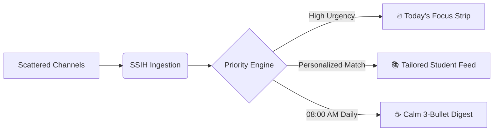

<div align="center">

# 🎓 SSIH — Smart Student Information Hub

### *Eliminate campus notification chaos. Prioritize what matters. Never miss a high-stakes deadline.*

<p align="center">
  
  
  
  
  
  
</p>

[✨ Live Demo](#-quick-start) • [📖 Architecture Story](architecture_story.md) • [🛠️ Tech Stack](techstack.md) • [🚀 Deployment](deploy.md)

</div>

---

## 📌 The Problem We Solve

Students currently navigate **40+ scattered communication channels** (WhatsApp groups, Telegram channels, ERP portals, official PDFs, faculty emails, and club chats). 

### The Cost of Information Overload:
* ❌ **Missed Deadlines**: Flash 24-hour internship applications and scholarship registrations get buried.
* ❌ **Notification Fatigue**: Students mute WhatsApp groups to stay sane, inadvertently missing official college circulars.
* ❌ **Irrelevant Clutter**: 1st-year students receive final-year placement panics, while seniors receive freshman club orientations.

---

## 💡 The SSIH Solution: *"Better Prioritization, Not More Noise"*

**SSIH** acts as an intelligent, calm prioritization layer that filters, categorizes, and scores every campus notice based on your individual department, year, and interests.



---

## 🌟 Key Features

| Feature | Description |
| :--- | :--- |
| **🔥 "Today's Focus" Action Bar** | Prominently surfaces deadlines closing in `< 48 hours` with real-time countdown badges (`🔴 Closes in 8h`). |
| **☕ Daily Morning Digest** | A calm, 3-bullet briefing delivered once a day to prevent notification anxiety and FOMO. |
| **🛡️ Trust Verification Badges** | Visual badges authenticating **Official Administration**, **Placement Cell**, **Verified Clubs**, and **Faculty**. |
| **📅 Chronological Deadline Timeline** | An interactive calendar with 1-click **Add to Google Calendar** sync. |
| **🎭 1-Click Persona Switcher** | Demo switcher allowing instant evaluation across multiple student profiles (CSE 4th Year, ECE 2nd Year, ME 1st Year, and Faculty). |
| **🌙 Anti-Burnout Quiet Hours** | Custom student quiet hours that silence all non-emergency campus alerts during sleep or study. |

---

## 🧮 Smart Priority Scoring Algorithm

Every announcement is assigned a dynamic **Priority Score (0 to 100)** computed in real time:

$$\text{PriorityScore} = (W_{\text{urgency}} \times S_{\text{urgency}}) + (W_{\text{relevance}} \times S_{\text{relevance}}) + (W_{\text{source}} \times S_{\text{source}}) - S_{\text{decay}}$$

* **Urgency ($S_{\text{urgency}}$)**: Imminent deadlines ($< 12\text{h}$, $< 24\text{h}$, $< 48\text{h}$) automatically boost to the top.
* **Relevance ($S_{\text{relevance}}$)**: Hard matches on Department + Year + Opt-in interest tags (`#placements`, `#hackathons`, `#robotics`).
* **Source Trust ($S_{\text{source}}$)**: Official Administration (25 pts), Placement Cell (24 pts), Verified Clubs (18 pts).
* **Decay ($S_{\text{decay}}$)**: Gradually drops score for older, non-deadline announcements.

---

## 🚀 Quick Start & Installation

Get the full-stack platform running locally in under **60 seconds**:

### Prerequisites
* [Node.js](https://nodejs.org/) (v18 or v20 LTS recommended)
* Git

### Step 1: Clone & Install Dependencies
```bash
git clone https://github.com/DevWithAshok/SSIH.git
cd SSIH

# Install root, backend, and frontend packages in one command
npm install
cd server && npm install
cd ../client && npm install
cd ..
```

### Step 2: Seed Mock Campus Dataset
```bash
npm run seed
```

### Step 3: Start Development Servers
```bash
npm run dev
```

* 🌐 **Frontend Application**: `http://localhost:3000` (or `http://localhost:3001`)
* ⚡ **Backend REST API**: `http://localhost:5000`
* 🩺 **API Health Check**: `http://localhost:5000/api/health`

---

## 🎭 Interactive Demo Personas

Use the **Persona Switcher** in the top-right navbar to test real-time feed adaptation:

| Persona | Profile | What Surfaces on Top |
| :--- | :--- | :--- |
| **Aarav Sharma** | CSE • 4th Year | Google & Microsoft SWE Internship Deadlines ($< 8\text{h}$ countdown) |
| **Diya Patel** | ECE • 2nd Year | Smart India Hackathon & IEEE Autonomous Drone Bootcamp |
| **Rohan Verma** | ME • 1st Year | Freshman Club Induction Expo & Baja SAE CAD Challenge |
| **Dr. Vikram / Dean** | Faculty & Admin | Unlocks **"Broadcast Notice"** publishing modal with audience targeting |

---

## 📂 Project Architecture

```
SSIH/
├── client/                         # React 18 + Vite Frontend Application
│   ├── src/
│   │   ├── components/            # Navbar, UrgentBanner, PostCard, DailyDigestModal, etc.
│   │   ├── context/               # Auth & Persona State Provider
│   │   ├── pages/Dashboard.jsx    # Calm Student Dashboard
│   │   └── index.css              # Custom Tailwind Glassmorphism Tokens
│   └── vite.config.js
│
├── server/                         # Node.js + Express REST API Backend
│   ├── src/
│   │   ├── config/db.js           # Data Access Layer & JSON Storage
│   │   ├── services/
│   │   │   ├── rankingEngine.js   # Priority Scoring Mathematical Engine
│   │   │   └── digestService.js   # Daily Morning Briefing Aggregator
│   │   ├── controllers/           # Auth & Announcement Controllers
│   │   ├── utils/seeder.js        # Realistic Campus Announcements Dataset
│   │   └── server.js              # Express Gateway on Port 5000
│   └── package.json
│
├── architecture_story.md          # Visual Story & Architecture Walkthrough
├── techstack.md                   # Full Technical Specifications
├── deploy.md                      # Production Deployment Guide (Docker/Render/Vercel)
└── package.json                   # Monorepo Orchestration Script
```

---

<details>
<summary><b>📋 Technical Data Models & TypeScript Interfaces (Click to expand)</b></summary>

```typescript
interface Announcement {
  id: string;
  title: string;
  content: string;
  summary: string;
  category: 'ACADEMIC' | 'CAREER_INTERNSHIP' | 'COMPETITION_HACKATHON' | 'CAMPUS_EVENT' | 'ADMIN_ALERT';
  tags: string[];
  targetDepartments: string[]; // ['ALL'] or ['Computer Science', 'IT']
  targetYears: number[];       // [3, 4]
  source: {
    authorId: string;
    authorName: string;
    organization: string;
    trustTier: 'OFFICIAL' | 'PLACEMENT_CELL' | 'VERIFIED_CLUB' | 'FACULTY';
  };
  deadlineDate?: string;
  actionUrl?: string;
  isUrgentOverride: boolean;
  createdAt: string;
}
```
</details>

---

## 📄 License & Attribution

Distributed under the **MIT License**. Built with ❤️ to eliminate campus stress and information overload.