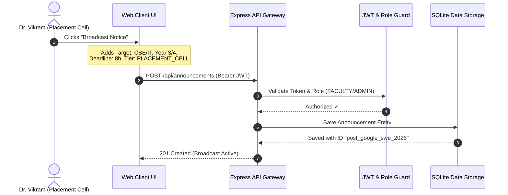
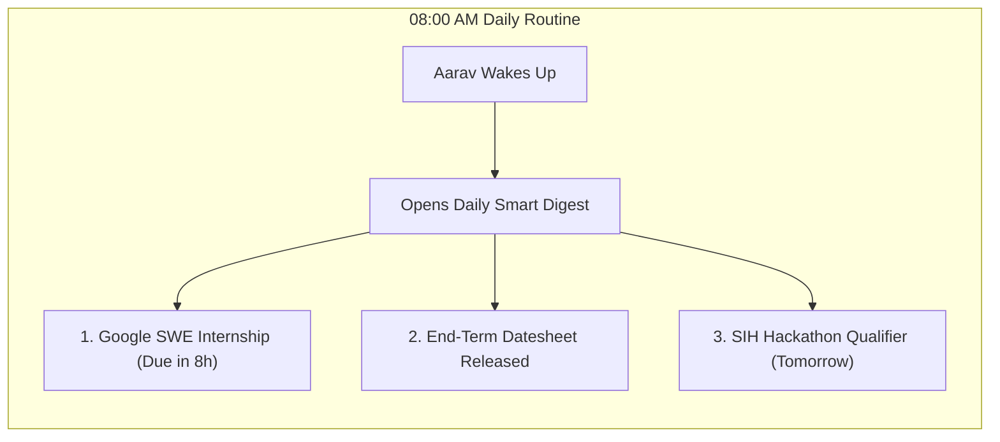
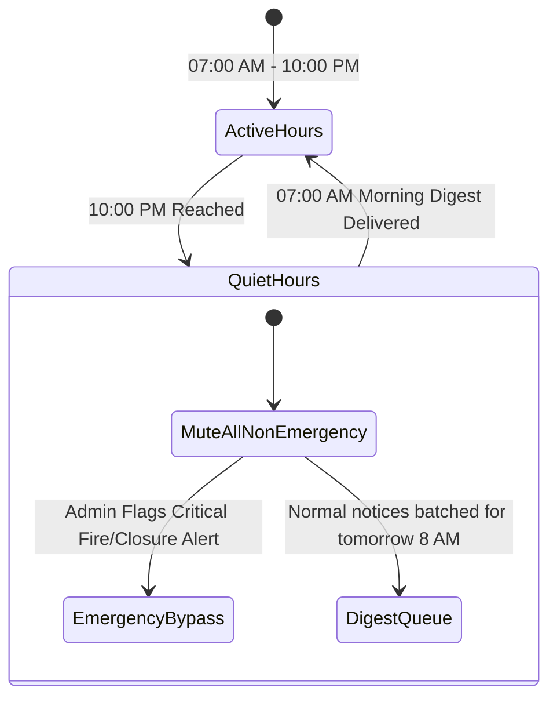

# The Story of InstantPS: How We Tamed Campus Chaos

> *"A tale of four students, an overwhelmed faculty officer, and the intelligent engine that transformed scattered noise into peace of mind."*

---

## The Cast of Characters

| Character | Role | The Struggle |
| :--- | :--- | :--- |
| **Aarav** | Final Year (CSE) | Drowning in 40+ WhatsApp groups; terrified of missing short-window placement deadlines. |
| **Diya** | 2nd Year (ECE) | Hunting for robotics hackathons, but notices are buried under irrelevant hostel circulars. |
| **Rohan** | 1st Year (ME) | Overwhelmed freshman; confused by senior exam circulars and trying to find club orientations. |
| **Dr. Vikram** | Placement Officer | Frustrated that students claim *"I never saw the notice!"* after top companies close application links. |
| **InstantPS (The Hero)** | The Smart Hub | The silent, calm architectural engine orchestrating the flow of truth across campus. |

---

## Chapter 1: The Storm of Chaos (The Problem)

It was 11:45 PM on a Tuesday night.

Aarav was staring at his phone with bloodshot eyes. His notification tray was a battlefield:
- **14 unread messages** in `CSE Batch 2026 Official`
- **89 unread memes & chatter** in `Placement Discussion Group 4`
- **3 unread emails** from the Dean's office with vague subject lines like *"Circular regarding amendment to subsection B"*
- **A screenshot of a PDF circular** forwarded 5 times on WhatsApp about a scholarship deadline closing in 12 hours.

At the exact same moment, **Dr. Vikram**, the Training & Placement Officer, was drafting an urgent announcement: **Google had just opened a 24-hour flash recruitment window for Winter Software Engineering Internships**. 

Dr. Vikram sent the email to the general student list and pasted the link in three WhatsApp groups. 

Within 10 minutes, the link was pushed down by 50 student messages asking *"Is CGPA 7.4 eligible?"*, *"Can mechanical students apply?"*, and *"Where is the link?"*.

Aarav went to sleep unaware. The system was broken.

---

## Chapter 2: The Birth of the Digital Gateway (API & Gateway Layer)



Enter **InstantPS**.

Instead of dumping notices into chaotic group chats, Dr. Vikram opens the **InstantPS Broadcast Portal**. 

He enters the Google internship details. But this time, the system asks for **structural metadata**:
- **Target Audience**: `Department: Computer Science, IT` | `Eligible Batches: Year 3 & 4`
- **Deadline Timestamp**: `Today at 08:00 PM (8 hours left)`
- **Trust Tier**: `PLACEMENT_CELL` (Authenticated badge)
- **Direct Action Link**: `https://careers.google.com/students`

He clicks **Publish**. The request flies to `POST /api/announcements` through the **Express API Gateway**, where the **JWT Role Guard** verifies his identity and signs off on the official notice. 

The announcement is safely locked into the **SQLite Data Store**. But the real magic is just beginning.

---

## Chapter 3: The Chamber of Intelligence (The Priority Scoring Engine)

Deep inside the server, the **Priority Scoring Engine** (`rankingEngine.js`) wakes up. It doesn't treat every student equally—it knows each student's unique reality.

```mermaid
flowchart TD
    RawPost[New Announcement: Google SWE Internship] --> ScoringEngine[Smart Priority Scoring Engine]
    
    subgraph Calculation["Dynamic Scoring Formula: Score = (W_u * S_u) + (W_r * S_r) + (W_s * S_s) - S_decay"]
        U[Urgency Score: 40 pts<br/>Due in < 12 hours!]
        R[Relevance Score: 35 pts<br/>Matches CSE + Year 4 + #placements]
        S[Source Trust Score: 24 pts<br/>Placement Cell Verified]
        D[Decay Penalty: 0 pts<br/>Freshly published]
    end

    ScoringEngine --> Calculation
    Calculation -->|Composite Score: 99 / 100| AaravFeed[Aarav's Feed: Rank #1 🔥 Top of Today's Focus]
    Calculation -->|Filtered Out: Not Mechanical| RohanFeed[Rohan's Feed: Hidden (Zero Clutter)]
```

### The Tale of Three Feeds:

#### 1. When Aarav (4th Year CSE) opens the app:
The engine runs the math:
- **Urgency ($S_u$)**: The deadline is in 8 hours $\rightarrow$ **+40 points** (Maximum Urgency).
- **Relevance ($S_r$)**: Aarav is 4th Year CSE with interest tags `#placements` and `#internships` $\rightarrow$ **+35 points** (Perfect Match).
- **Source Trust ($S_s$)**: Verified Placement Cell $\rightarrow$ **+24 points**.
- **Composite Score = 99 / 100**.
- **Result**: The Google Internship anchors at the **very top of Aarav's screen** in a glowing **Crimson Action Bar** with a ticking countdown: `"🔴 Closes in 8 hours"`.

#### 2. When Diya (2nd Year ECE) opens the app:
- She doesn't qualify for the final-year Google job, so the engine keeps her feed free of placement panic.
- Instead, the **Smart India Hackathon** and the **IEEE Robotics Drone Workshop** score **92 / 100**, floating right to the top of her feed.

#### 3. When Rohan (1st Year ME) opens the app:
- The engine recognizes he is a freshman in Mechanical Engineering.
- It completely filters out senior placement notices. Instead, Rohan sees the **Freshman Club Expo** and the **Baja SAE CAD Challenge**. Zero noise. Zero confusion.

---

## Chapter 4: The Sanctuary of Calm (Frontend UI & The Morning Digest)



It is 08:00 AM on Wednesday morning.

Aarav’s alarm rings. In the past, his morning started with anxiety—scrolling through 200 missed WhatsApp messages to see if anything important was announced overnight.

Today, he opens **InstantPS**. 

A calming, elegant card appears:
> **"Good morning, Aarav! You have 1 urgent deadline requiring your attention today."**
> 
> - 🔴 **Google SWE Winter Internship**: Portal closing at 08:00 PM. [Apply Now $\rightarrow$]
> - 📚 **End-Term Exam Schedule**: Final datesheet published by COE.
> - 🏆 **Smart India Hackathon**: Internal team registrations close tomorrow.

No flashing ads. No irrelevant chatter. Aarav taps **"Apply Now"**, submits his resume in 2 minutes, and taps the **Calendar Icon** on his SIH hackathon reminder to sync it directly to his Google Calendar.

---

## Chapter 5: The Silent Sentinel (Anti-Burnout Quiet Hours)



At 10:00 PM that night, InstantPS activates Aarav's **Quiet Hours Protocol**. 

While other apps continue to chime and buzz with late-night gossip, InstantPS enters silent watch mode. Normal notices are held peacefully in the background and queued for tomorrow morning's digest. 

Only a genuine, dean-level **Emergency Alert** (such as campus closures or severe weather) possesses the cryptographic clearance to bypass the quiet shield.

Aarav sleeps peacefully, knowing that if something truly matters, InstantPS has his back.

---

## Architectural Epilogue: The System Blueprint

Here is how each layer of the story maps directly to the code running on your machine right now:

```
┌─────────────────────────────────────────────────────────────────────────┐
│                      1. THE CLIENT SANCTUARY                            │
│  React 18 + Vite + Tailwind CSS + Lucide Icons                         │
│  • Navbar.jsx             -> Multi-Persona Switcher & Search            │
│  • UrgentBanner.jsx       -> "Today's Focus" Imminent Countdown Bar     │
│  • DailyDigestModal.jsx   -> 3-Bullet Calm Morning Briefing             │
│  • DeadlineCalendar.jsx   -> Chronological Timeline & Google Cal Sync   │
└────────────────────────────────────┬────────────────────────────────────┘
                                     │ HTTP / REST (JWT Auth)
┌────────────────────────────────────▼────────────────────────────────────┐
│                      2. THE INTELLIGENCE CORE                           │
│  Node.js + Express.js API Gateway                                      │
│  • rankingEngine.js       -> Priority Score: (Wu·Su)+(Wr·Sr)+(Ws·Ss)-D │
│  • digestService.js       -> Personalized Briefing Aggregator           │
│  • authController.js      -> Multi-Persona Role Provider               │
│  • announcementCtrl.js    -> Feed, Deadlines, Bookmark & Dismiss       │
└────────────────────────────────────┬────────────────────────────────────┘
                                     │ Query & DAL
┌────────────────────────────────────▼────────────────────────────────────┐
│                      3. THE PERSISTENT VAULT                            │
│  SQLite Database (`server/data/db.json`)                                │
│  • Users Table            -> Profiles, Department, Batches, Interests   │
│  • Announcements Table    -> Notices, Urgency Flags, Target Criteria    │
│  • UserInteractions Table -> Read Status, Bookmarks, Dismissals         │
└─────────────────────────────────────────────────────────────────────────┘
```

---

## Moral of the Architecture

> **True technological sophistication is not about broadcasting more information to everyone; it is about having the intelligence to show only what matters, to the right person, at the exact moment they need it.**
