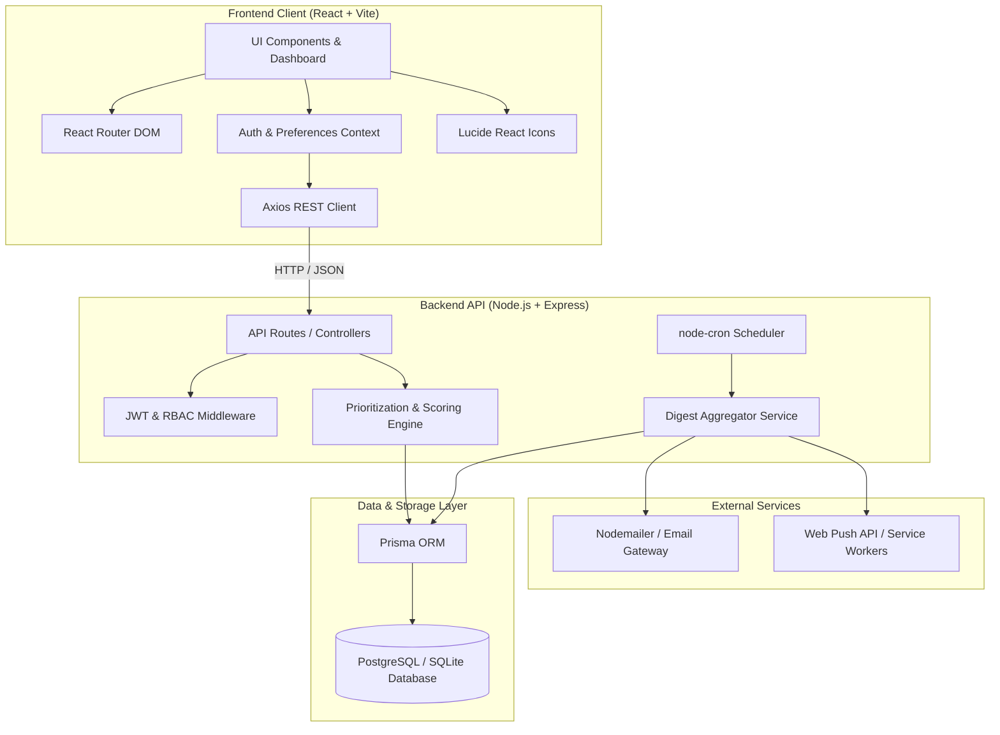

# InstantPS — Comprehensive Tech Stack Documentation

This document outlines the complete technology stack, architectural choices, and dependency specifications for building **InstantPS: Smart Student Information Hub**.

---

## 1. Tech Stack Overview Matrix

| Architecture Layer | Primary Technology | Purpose & Rationale | Alternative / MVP Option |
| :--- | :--- | :--- | :--- |
| **Frontend Framework** | **React 18 + Vite** | High-performance Single Page Application (SPA), fast HMR, reactive state management | Vanilla HTML5 / ES6+ JS |
| **Styling & Design System** | **Tailwind CSS + PostCSS** | Rapid UI prototyping, custom color tokens, modern glassmorphism & dark/light theme support | Vanilla CSS with CSS Custom Properties |
| **Icons & Visual Assets** | **Lucide Icons (`lucide-react`)** | Clean, lightweight, modern iconography for categories, badges, and alerts | Heroicons / FontAwesome |
| **State & Data Fetching** | **React Context API + Axios / TanStack Query** | Centralized auth state, caching, optimistic UI updates, seamless feed pagination | Native `fetch` API |
| **Backend Runtime** | **Node.js (LTS v18+)** | Asynchronous, event-driven JavaScript runtime with rich package ecosystem | Python (FastAPI / Flask) |
| **Web API Framework** | **Express.js** | Lightweight, robust REST API routing, middleware support, and simplicity | Fastify / NestJS |
| **Database** | **SQLite (Development / Prototype)**<br>**PostgreSQL (Production)** | Relational database ideal for structured queries (users, notices, departments, categories) | MongoDB (Mongoose) |
| **ORM / Query Builder** | **Prisma ORM** | Type-safe schema definition, automated migrations, intuitive querying API | Sequelize / Knex.js |
| **Authentication & Security** | **JWT (`jsonwebtoken`) + `bcryptjs`** | Stateless Bearer token auth, password hashing, Role-Based Access Control (RBAC) | Firebase Auth / Supabase Auth |
| **Scheduler & Workers** | **`node-cron` / BullMQ** | Automated execution for daily morning/evening digests and deadline expiration checks | Node `setInterval` (lightweight) |
| **Email Digest Service** | **Nodemailer / Resend** | Sending curated morning briefing emails to students | SendGrid API |
| **Hosting & Deployment** | **Vercel / Netlify (Client)**<br>**Render / Railway (Server)**<br>**Supabase / Neon (DB)** | Serverless frontend deployment + persistent containerized backend with managed Postgres | Docker / Localhost |

---

## 2. Detailed Layer-by-Layer Breakdown



---

### 2.1 Frontend Stack

- **Core Framework**: `React 18` with `Vite` as the build tool for near-instant cold server start and blazing-fast Hot Module Replacement (HMR).
- **Styling**: `Tailwind CSS 3.4+` configured with a custom student-focused calm color palette:
  - Slate / Zinc neutral shades for zero visual fatigue.
  - Accent colors for priority badges:
    - 🔴 **Urgent (< 24h)**: Crimson / Rose (`#E11D48`)
    - 🟡 **Approaching (< 48h)**: Amber (`#F59E0B`)
    - 🔵 **Academic**: Indigo (`#4F46E5`)
    - 🟢 **Career / Placement**: Emerald (`#059669`)
    - 🟣 **Competitions & Hackathons**: Purple (`#7C3AED`)
- **Date & Time Utilities**: `date-fns` or `dayjs` for dynamic relative time calculations (`"due in 4 hours"`, `"yesterday"`).
- **Animations & Micro-interactions**: `framer-motion` for smooth card transitions, tab switching, and collapsible panels.
- **Icons**: `lucide-react` for consistent, crisp SVG icons.

---

### 2.2 Backend Stack

- **Runtime Environment**: `Node.js (v18 or v20 LTS)`
- **HTTP Server**: `Express.js (v4.x)`
  - `cors`: Secure Cross-Origin Resource Sharing for API client.
  - `helmet`: Essential HTTP security headers.
  - `morgan`: Request logging for developer debugging.
  - `express-rate-limit`: Rate limiting to protect against brute-force attacks and spam posting.
- **Authentication**:
  - `jsonwebtoken (JWT)`: Stateless session verification with token expiration.
  - `bcryptjs`: Industry standard salted password hashing (cost factor 10).

---

### 2.3 Prioritization Engine Logic

The custom ranking engine runs in-memory on the backend API layer:

```
Algorithm Weighting Parameters:
- W_urgency   = 0.40  (Time-to-deadline multiplier)
- W_relevance = 0.35  (Department, Year, and Interest Tag match)
- W_source    = 0.25  (Official Admin = 1.0, Placement = 0.9, Club = 0.7, Peer = 0.4)
- S_decay     = Exponential decay factor based on post publication age
```

---

### 2.4 Database & Data Storage

- **Database Engine**: 
  - **Development**: SQLite (`file:./dev.db`) for instant zero-configuration setup.
  - **Production**: PostgreSQL 15+ for relational integrity, JSONB support for dynamic tags, and fast indexed search queries.
- **ORM**: `Prisma ORM`
  - Declarative `schema.prisma` file.
  - Fully typed database client.
  - Built-in migration CLI (`prisma migrate dev`).
  - Prisma Studio GUI (`npx prisma studio`) for real-time data inspection.

---

### 2.5 Background Jobs & Notification Pipeline

- **Job Scheduling**: `node-cron`
  - **Morning Digest Job**: Runs daily at `08:00 AM` local server time to compile personalized top-3 priorities for each student.
  - **Deadline Expiration Check**: Runs every hour to transition expired opportunities from active feed to archived status.
- **Email Delivery**: `Nodemailer` with SMTP transport (Gmail / Resend / Mailtrap for development testing).

---

## 3. Package & Dependency Specifications

### 3.1 Backend (`server/package.json`)

```json
{
  "name": "instantps-server",
  "version": "1.0.0",
  "description": "InstantPS Backend API & Smart Prioritization Engine",
  "main": "src/server.js",
  "scripts": {
    "dev": "nodemon src/server.js",
    "start": "node src/server.js",
    "seed": "node src/utils/seeder.js",
    "db:migrate": "npx prisma migrate dev",
    "db:studio": "npx prisma studio"
  },
  "dependencies": {
    "@prisma/client": "^5.10.0",
    "bcryptjs": "^2.4.3",
    "cors": "^2.8.5",
    "dotenv": "^16.4.5",
    "express": "^4.18.3",
    "express-rate-limit": "^7.1.5",
    "helmet": "^7.1.0",
    "jsonwebtoken": "^9.0.2",
    "morgan": "^1.10.0",
    "node-cron": "^3.0.3",
    "nodemailer": "^6.9.10"
  },
  "devDependencies": {
    "nodemon": "^3.1.0",
    "prisma": "^5.10.0"
  }
}
```

---

### 3.2 Frontend (`client/package.json`)

```json
{
  "name": "instantps-client",
  "version": "1.0.0",
  "private": true,
  "type": "module",
  "scripts": {
    "dev": "vite",
    "build": "vite build",
    "preview": "vite preview"
  },
  "dependencies": {
    "axios": "^1.6.7",
    "clsx": "^2.1.0",
    "date-fns": "^3.3.1",
    "framer-motion": "^11.0.8",
    "lucide-react": "^0.344.0",
    "react": "^18.2.0",
    "react-dom": "^18.2.0",
    "react-router-dom": "^6.22.2",
    "tailwind-merge": "^2.2.1"
  },
  "devDependencies": {
    "@types/react": "^18.2.56",
    "@types/react-dom": "^18.2.19",
    "@vitejs/plugin-react": "^4.2.1",
    "autoprefixer": "^10.4.18",
    "postcss": "^8.4.35",
    "tailwindcss": "^3.4.1",
    "vite": "^5.1.4"
  }
}
```

---

## 4. Development Environment Prerequisites

To run this stack locally, ensure the following tools are installed:

- **Node.js**: `v18.17.0` or later (verify with `node -v`)
- **npm**: `v9.0.0` or later (verify with `npm -v`)
- **Git**: For version control
- **Browser**: Any modern evergreen browser (Chrome, Edge, Firefox, Safari)

---

## 5. Security & Best Practices Implemented

1. **Password Security**: Passwords never stored in plain text; hashed using salted `bcryptjs`.
2. **Stateless JWTs**: Access tokens passed via `Authorization: Bearer <token>` header with defined expiry windows.
3. **Role-Based Guards**: Separate endpoint gates for `STUDENT` vs `FACULTY` vs `ADMIN` vs `CLUB_LEAD`.
4. **Environment Isolation**: All credentials, JWT secrets, and database strings encapsulated within `.env` files.
5. **No Visual Overload / Dark Mode First**: Thoughtfully designed interface following calm UI principles to reduce stress and cognitive fatigue.
